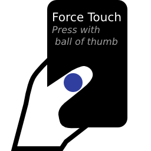

# Add Extra Screen Button for Android by Special Touch

## Introduction
Android OS reports pressure and/or size of your touch when you tap, press, swipe, and so on.
You can use special pressure/size value to fire any action, and this project provides interfaces and triggers to do so.
The trigger works like an extra button on your screen by unique touching.

The special values are

*  Large touch area -> Force Touch
*  Small touch area -> Knuckle Touch
*  Touch area growing so much -> Wiggle Touch.

## Force Touch

If you touch your screen with the ball of thumb, the touch area increases.
Call it "Force Touch" in this project.
It is possible to distinguish ordinary touch operation from deliberately Force Touch because there is a distinct difference between these touch area.
By checking if a touch event is started from Force Touch, you can change the action of the touch.

## Knuckle Touch
If you touch your screen with knuckle, you can make very small touch area.
The same as Force Touch, you can fire specified action when you touch on small area.

## Wiggle Touch
Above two methods use absolute threshold value to detect unique touching. However the absolute value causes inconvenient situations, such as, you cannot fire specified action with other fingers that have not been adjusted, it is not working while charging because characteristics of touch sensor is changed by charging current on some phones.

aaa

## Xposed Module is here!
[tkgktyk/ForceTouch/xposed](xposed) is a Xposed modeule to detect Force Touch and switch touch action.
Repository: [Force Touch Detector (FTD)](http://repo.xposed.info/module/jp.tkgktyk.xposed.forcetouchdetector).

FTD assigns seven force actions:

*  Tap
*  Double Tap
*  Long Press
*  Flick Left
*  Flick Right
*  Flick Up
*  Flick Down

Of course FTD doesn't bother normal operation by the threshold of pressure.

### Getting Started
At first, check your hardware supports FTD functions or not.
Open a threshold screen, `Pressure -> Threshold`, and then test *tap* and *force touch* with two buttons.
If Max, Pressure and Ave are changed by each touch, your touch screen supports the pressure parameter, you can use FTD by pressure.
If not so, your phone doesn't support pressure, next try `Size -> Threshold` screen.

Note that some smartphones don't support both the pressure and the size parameter.
FTD doesn't work on such a device.

After checking the capability of your touch screen, practice and adjust Force Touch with Threshold screen.
Tap small button and do force touch on large button 5 times or more respectively, you'll get a Max value for normal tap and an Ave value for force touch.
The Ave value must be **higher** than the Max value, you should practice force touch until so.

Finally, input a number between the Ave and the Max, and turn `Master Switch` on.

### Adjustment
There are 3 parameters to adjust sensitivity for force touch.

<dl>
  <dt>Threshold</dt>
    <dd>When pressure or size of your touch exceed this value, it is recognized as a force touch.</dd>
  <dt>Detection Window</dt>
    <dd>The length of time FTD waits for force touch. If zero, FTD checks only the beginning of your touch stroke.</dd>
  <dt>Detection Sensitivity</dt>
    <dd>The sensitivity for force tap and flick. If zero, Force Touch is always interpreted as a flick. If too high value, it is always tap. The range is 0 to about 20, depends on hardware.</dd>
</dl>

I propose two strategies for adjustment.

1. *Long* detection window and *high* threshold value
1. *Short* detection window and *mid* threshold value

Maybe the experience of the former is near to Apple's Force Touch, squashing.
However Android devices detect the pressure of touch by touch area even if you enable Pressure Threshold.
In the other words, FTD's Force Touch based on Android API and Apple's one are fundamentally different.
So I recommend to try both strategies.
